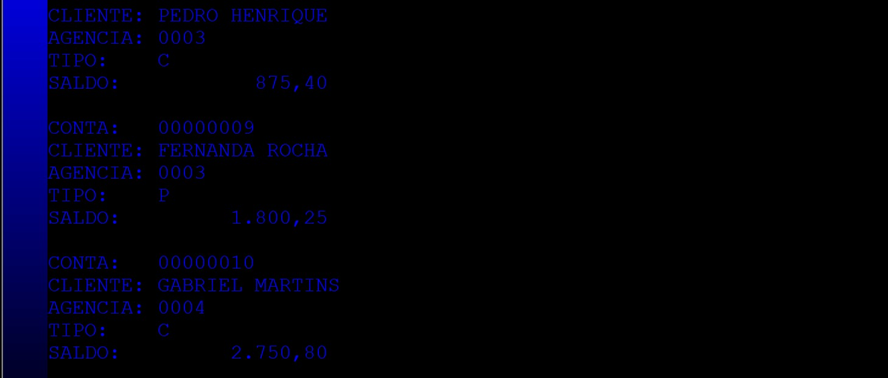
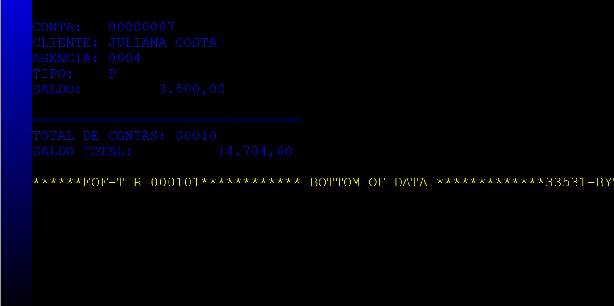

# Projeto 4 — Processamento de Contas Bancárias em COBOL

Projeto desenvolvido para o curso **Acelera Maker** (Montreal), Semana 6.

Sistema batch em COBOL para mainframe IBM MVS 3.8, responsável por ordenar e processar um arquivo de contas bancárias e apresentar estatísticas consolidadas.

## Funcionalidades

- Ordenação das contas por agência com o utilitário SORT
- Leitura do arquivo ordenado pelo programa COBOL
- Exibição dos dados de cada conta: número, cliente, agência, tipo e saldo
- Cálculo do total de contas e saldo total consolidado

## Estrutura do projeto

| Arquivo | Descrição |
|---|---|
| `project/PROCONTA.cbl` | Programa principal em COBOL |
| `project/CONTACB.cpy` | Copybook com layout do registro de conta |
| `project/CONTAS.txt` | Arquivo de entrada com os dados das contas |
| `project/CONTAS_ORD.txt` | Arquivo ordenado por agência (saída do SORT) |

## Como executar

1. Fazer upload dos datasets para o MVS via TN3270 Plus.
2. Submeter o job JCL pelo TSO.
3. O job realiza a ordenação e chama o programa COBOL automaticamente.
4. O programa lê o arquivo ordenado e exibe as contas com os totais calculados.

## Resultado esperado

Ao executar o job, o sistema deve processar e exibir cada registro de conta ordenado por agência, seguido de um resumo com:

- Número total de contas processadas
- Saldo total consolidado de todas as contas

Exemplo de saída esperada:

- Conta: 00012345 — Cliente: JOÃO SILVA — Agência: 1234 — Tipo: CC — Saldo: 1.250,50
- Conta: 00023456 — Cliente: MARIA OLIVEIRA — Agência: 1234 — Tipo: CP — Saldo: 3.450,00
- Conta: 00034567 — Cliente: PEDRO COSTA — Agência: 5678 — Tipo: CC — Saldo: 980,75

Totais:

- Total de contas: 3
- Saldo total: 5.681,25

> Observação: valores e contas acima são um exemplo ilustrativo. O resultado real depende do conteúdo em `project/CONTAS.txt`.

## Demonstração real da compilação

A seguir, estão as imagens que mostram o processo de compilação e execução do projeto no ambiente MVS/Hercules:

> Para exibir corretamente as imagens acima, adicione os arquivos abaixo na pasta `images/` do projeto:
>
> - `compilacao-1.png`
> - `compilacao-2.png`
> - `compilacao-3.png`

